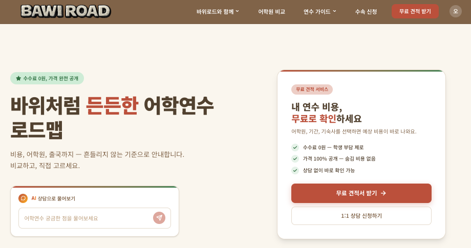
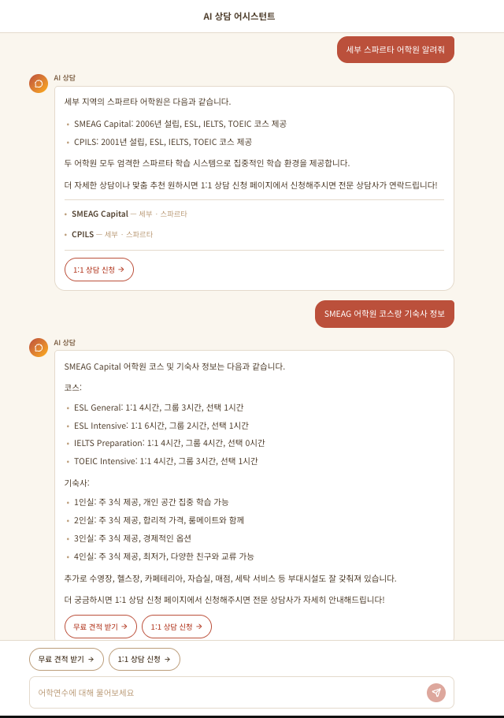

# BAWI ROAD - 필리핀 어학연수 원스톱 플랫폼

> 어학원 검색부터 AI 상담, 견적 요청, 수속 신청까지 한 곳에서.

🔗 **서비스 바로가기**: [bawiroad.com](https://bawiroad.com)



## 소개

**바위로드(BAWI ROAD)** 는 필리핀 어학연수를 준비하는 사용자를 위한 원스톱 서비스 플랫폼입니다.
수수료 0원, 가격 100% 공개를 원칙으로 어학원 비교부터 출국까지의 전 과정을 지원합니다.

이 레포지토리는 **고객용 서비스 페이지**이며, 관리자 백오피스는 별도 레포에서 관리됩니다.

## 주요 기능

### AI 상담 챗봇

어학원 DB를 기반으로 실시간 스트리밍 응답을 제공하는 AI 상담 어시스턴트입니다.
어학원 추천, 코스/기숙사 정보, 비용 안내 등을 즉시 확인할 수 있습니다.



### 어학원 검색 & 비교

지역, 코스 유형, 기숙사 조건 등으로 필리핀 어학원을 검색하고 비교할 수 있습니다.

### 견적 요청 & 수속 신청

어학원, 기간, 기숙사를 선택하면 예상 비용을 바로 확인할 수 있고,
수속 신청 시 서류 업로드부터 진행 상태 확인까지 온라인으로 처리됩니다.

## 기술 스택

| 구분 | 기술 |
|------|------|
| **프레임워크** | Astro 5 + React 19 (Islands Architecture) |
| **스타일링** | Tailwind CSS 4 + shadcn/ui |
| **상태 관리** | TanStack Query 5 (서버 상태) + nanostores (클라이언트 상태) |
| **폼 처리** | react-hook-form + zod |
| **백엔드** | Supabase (PostgreSQL + RLS + Edge Functions) |
| **AI** | OpenAI GPT-4.1-mini (SSE 스트리밍) |
| **호스팅** | Cloudflare Pages |
| **파일 스토리지** | Cloudflare R2 (Presigned URL) |
| **봇 방지** | Cloudflare Turnstile |

## 아키텍처

```
┌─────────────────────────────────────────────────┐
│                 Cloudflare Pages                │
│              (Static Build / CDN)               │
├─────────────────────────────────────────────────┤
│  Astro (SSG)          React Islands (CSR)       │
│  ├── 레이아웃/라우팅     ├── 검색/필터링           │
│  ├── SEO/메타           ├── AI 챗봇              │
│  └── 정적 콘텐츠        ├── 폼 (견적/수속/문의)    │
│                        └── 마이페이지             │
├─────────────────────────────────────────────────┤
│                   Supabase                       │
│  ├── PostgreSQL + RLS (데이터 접근 제어)          │
│  ├── Edge Functions (AI Chat, Storage Presign)   │
│  └── Auth (이메일 인증)                           │
├─────────────────────────────────────────────────┤
│              Cloudflare R2                       │
│           (수속 서류 파일 저장)                    │
└─────────────────────────────────────────────────┘
```

**Astro Islands 패턴**: 정적 HTML을 먼저 렌더링하고, 인터랙션이 필요한 부분만 React로 hydrate합니다. 초기 로드 성능과 SEO를 모두 확보하는 구조입니다.

## 프로젝트 구조

```
src/
├── pages/              # Astro 라우트 (.astro)
├── react-pages/        # React 페이지 컴포넌트
│   ├── academy/        #   어학원 검색/상세
│   ├── auth/           #   로그인/회원가입
│   ├── chat/           #   AI 챗봇
│   ├── enrollment/     #   수속 신청
│   ├── home/           #   홈
│   ├── inquiry/        #   1:1 문의
│   ├── my/             #   마이페이지
│   └── quote/          #   견적 요청
├── api/                # Supabase API 호출 함수 (페이지별)
├── components/         # 공통 컴포넌트 + shadcn/ui
├── data/               # 상수 데이터 (페이지별)
├── hooks/              # 커스텀 훅
├── lib/                # 유틸리티 (supabase client 등)
├── stores/             # nanostores (전역 상태)
└── types/              # TypeScript 타입

supabase/
├── functions/          # Edge Functions (Deno)
│   ├── ai-chat/        #   AI 챗봇 (OpenAI 스트리밍)
│   └── storage-presign/#   R2 파일 Presigned URL
└── migrations/         # DB 마이그레이션
```

## 시작하기

### 사전 요구사항

- Node.js 20+
- pnpm

### 설치 & 실행

```bash
# 의존성 설치
pnpm install

# 환경변수 설정
cp .env.example .env
# .env 파일에 Supabase URL, Anon Key 등 입력

# 개발 서버 실행
pnpm run dev
```

### 환경변수

| 변수 | 설명 |
|------|------|
| `PUBLIC_SUPABASE_URL` | Supabase 프로젝트 URL |
| `PUBLIC_SUPABASE_ANON_KEY` | Supabase 공개 키 |
| `VITE_R2_PUBLIC_URL` | Cloudflare R2 공개 도메인 |
| `PUBLIC_TURNSTILE_SITE_KEY` | Cloudflare Turnstile 사이트 키 |
